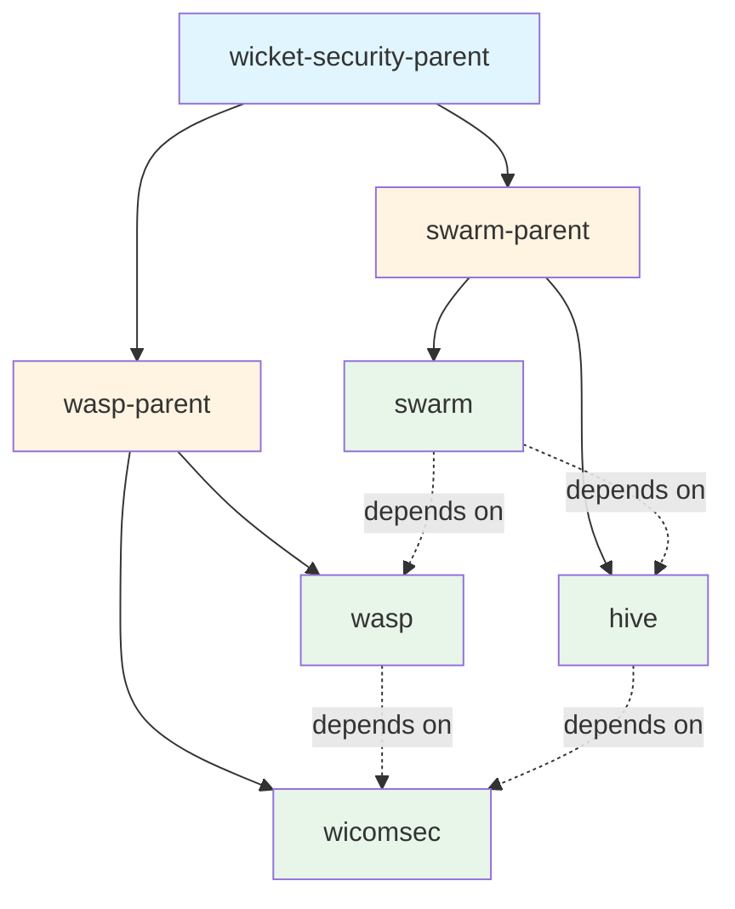
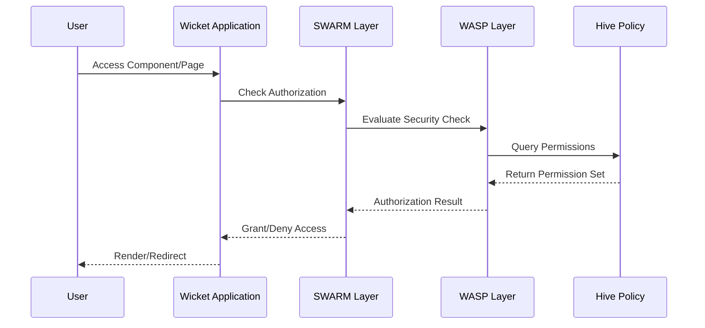
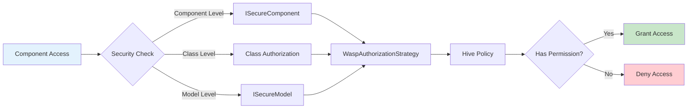
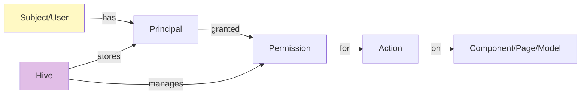
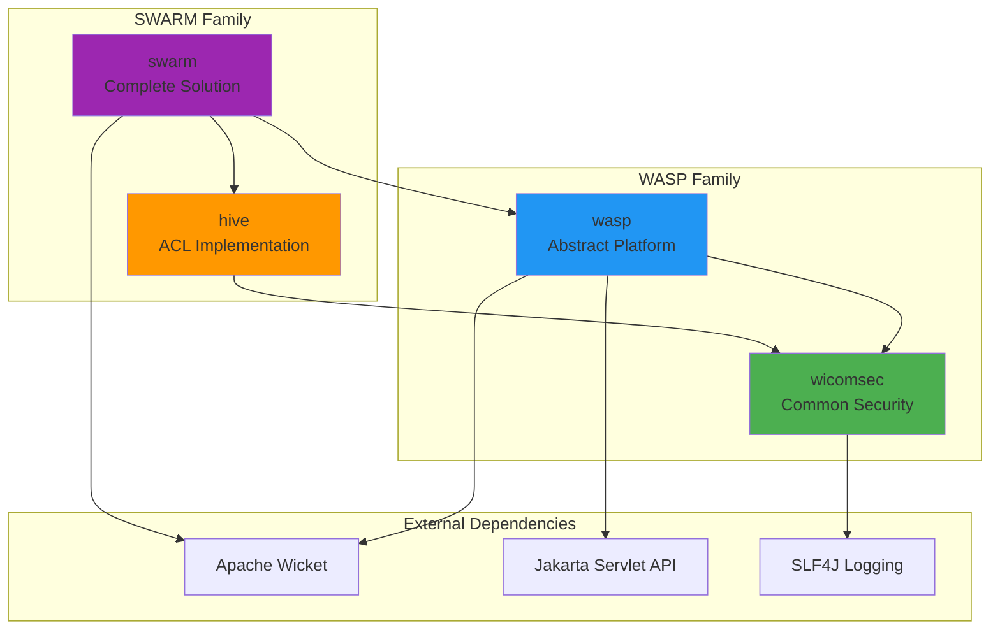

# Wicket Security

A comprehensive security framework for Apache Wicket applications, providing authentication and authorization capabilities through a modular, extensible architecture.

## Overview

Wicket Security is a multi-module security framework designed for Apache Wicket web applications. It provides role-based access control (RBAC), permission-based security, and fine-grained authorization at the component, page, and model levels.

**Version:** 10.8.0-SNAPSHOT  
**License:** Apache License 2.0  
**Inception Year:** 2006

## Architecture

The framework consists of four main modules organized into two parent projects:

### Module Hierarchy



## Modules

### 1. **Wicomsec** (Wicket Common Security)
**Artifact:** `wicketstuff-security-wicomsec`

The foundation module containing common security-related classes and interfaces.

**Key Components:**
- `Actions` - Central registry for action factories
- `ActionFactory` - Factory pattern for creating security actions
- `WaspAction` - Represents security actions (read, write, enable, render, etc.)
- Common security abstractions and utilities

**Purpose:** Provides shared security primitives used by other modules.

### 2. **WASP** (Wicket Abstract Security Platform)
**Artifact:** `wicketstuff-security-wasp`

The core security framework providing abstract security mechanisms for Wicket applications.

**Key Components:**
- `ISecurityCheck` - Interface for security checks
- `WaspAuthorizationStrategy` - Integration with Wicket's authorization system
- `ISecureComponent` - Interface for components with security features
- `ISecureModel` - Interface for models with security features
- Component-level and class-level security checks

**Purpose:** Provides the abstract foundation for implementing security in Wicket applications, independent of specific authentication/authorization implementations.

**Dependencies:**
- wicomsec
- Apache Wicket Extensions
- Jakarta Servlet API

### 3. **Hive**
**Artifact:** `wicketstuff-security-hive`

A basic ACL (Access Control List) security implementation.

**Key Components:**
- `Hive` - Security policy container (similar to JAAS Policy)
- `HiveMind` - Registry for multiple hive instances
- `PolicyFileHiveFactory` - Factory for creating hives from policy files
- `Principal` - Represents security principals (users, roles)
- `Permission` - Represents permissions
- `Subject` - Represents authenticated subjects

**Purpose:** Provides a concrete ACL-based security policy implementation, allowing multiple security policies per JVM.

**Dependencies:**
- wicomsec

### 4. **SWARM** (Standard Wicket Authentication and Rights Management)
**Artifact:** `wicketstuff-security-swarm`

A complete, ready-to-use security implementation combining WASP and Hive.

**Key Components:**
- `SwarmWebApplication` - Base class for Swarm-enabled applications
- `SwarmStrategy` - Authorization strategy implementation
- `SwarmActionFactory` - Factory for Swarm-specific actions
- `DataSecurityCheck` - Security checks for data access
- Integration layer combining WASP and Hive

**Purpose:** Provides a production-ready security solution with minimal configuration required.

**Dependencies:**
- wasp
- hive

## Component Interaction Flow



## Security Check Flow



## Permission Model



## Usage Overview

### Basic Integration

1. **Extend SwarmWebApplication:**
```java
public class MyApplication extends SwarmWebApplication {
    @Override
    protected void setupActionFactory() {
        super.setupActionFactory();
    }
    
    @Override
    protected Object getHiveKey() {
        return "myapp";
    }
}
```

2. **Define Security Policies:**
   - Create policy files defining principals and permissions
   - Configure Hive to load these policies

3. **Secure Components:**
   - Implement `ISecureComponent` on custom components
   - Use security checks to control rendering and enabling
   - Apply security at page, component, or model level

## Key Features

- ✅ **Component-Level Security** - Secure individual Wicket components
- ✅ **Page-Level Security** - Control access to entire pages
- ✅ **Model-Level Security** - Secure data access through models
- ✅ **Action-Based Permissions** - Fine-grained control (render, enable, etc.)
- ✅ **Multiple Security Policies** - Support for multiple Hives per JVM
- ✅ **Extensible Architecture** - Abstract base allows custom implementations
- ✅ **ACL Support** - Built-in access control list implementation
- ✅ **Integration Ready** - Works seamlessly with Wicket's authorization system

## Build Information

**Build Tool:** Maven  
**Java Version:** Compatible with Jakarta EE 10  
**Wicket Version:** 10.x

### Building the Project

```bash
mvn clean install
```

### Running Tests

```bash
mvn test
```

Note: Performance tests (SpeedTest.java) are excluded in release builds.

## Developers

- **Maurice Marrink** (Deceased) - Original Developer - Topicus
- **Emond Papegaaij** - Developer - Topicus  
- **Olger Warnier** - Developer - Joining Tracks / Zorginiatieven

## Module Dependencies Graph



## License

Licensed under the Apache License, Version 2.0. See LICENSE file for details.

## Contributing

This project is part of the WicketStuff project (http://wicketstuff.org/).

## Support

For issues and questions, please refer to the WicketStuff community resources.
